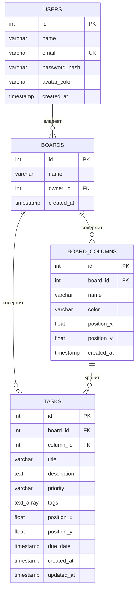

# Checkly — задание по БД

Модель состоит ровно из 4 таблиц:

- `users`
- `boards`
- `board_columns`
- `tasks`

Стек: PostgreSQL + Prisma.

## Структура

```text
checkly-db/
├── prisma/
│   ├── schema.prisma
│   ├── seed.ts
│   └── migrations/
│       └── 20260918150000_init/
│           └── migration.sql
├── sql/
│   └── queries.sql
└── README.md
```

## 1. ER-диаграмма



### Связи

- `users.id` → `boards.owner_id` — 1:N
- `boards.id` → `board_columns.board_id` — 1:N
- `boards.id` → `tasks.board_id` — 1:N
- `board_columns.id` → `tasks.column_id` — 1:N

### Почему 4 таблицы

`board_columns` — самостоятельная сущность: у неё есть имя, цвет и координаты на холсте. Поэтому её не объединяем с `boards` и не заменяем простым enum-полем.

### Удаление

- `boards.owner_id` → `ON DELETE CASCADE`
- `board_columns.board_id` → `ON DELETE CASCADE`
- `tasks.board_id` → `ON DELETE CASCADE`
- `tasks.column_id` → `ON DELETE RESTRICT`

`RESTRICT` не позволяет удалить колонку, пока в ней находятся задачи. Сначала задачи переносятся в другую колонку. Это соответствует issue #4.

## 2. Prisma

Файл `prisma/schema.prisma` содержит полную модель базы.

Для создания миграции:

```bash
npx prisma migrate dev --name init
```

SQL миграции уже положен в:

```text
prisma/migrations/20260918150000_init/migration.sql
```

## 3. Индексы

Создаются индексы:

```sql
CREATE INDEX idx_boards_owner ON boards(owner_id);
CREATE INDEX idx_tasks_board ON tasks(board_id);
CREATE INDEX idx_tasks_column ON tasks(column_id);
```

Для `users.email` отдельный индекс не нужен: `UNIQUE` создаёт уникальный индекс автоматически.

## 4. Тестовые данные

`prisma/seed.ts` создаёт:

- 5 пользователей;
- 3 доски;
- 3 колонки на каждую доску;
- 10 задач.

Запуск:

```bash
npx ts-node prisma/seed.ts
```

## 5. SELECT-запросы

Все три запроса находятся в `sql/queries.sql`:

1. Все задачи доски.
2. Задачи колонки `Done` конкретной доски.
3. Количество задач в каждой колонке.

## 6. DBeaver

После запуска миграции и seed:

1. Подключиться к PostgreSQL.
2. Открыть базу `checkly`.
3. Убедиться, что есть 4 таблицы:
   - `users`
   - `boards`
   - `board_columns`
   - `tasks`
4. Выполнить запросы из `sql/queries.sql`.
5. Сделать скриншоты:
   - дерева таблиц;
   - результата первого SELECT;
   - результата второго SELECT;
   - результата третьего SELECT;
   - ER Diagram в DBeaver.

> Само подключение к вашей локальной PostgreSQL и создание скриншотов выполняется на компьютере, где запущена БД.
