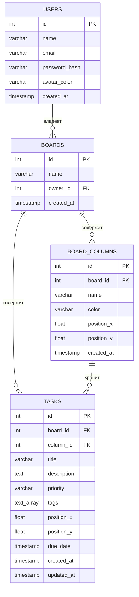

# Checkly — задание по БД

Модель состоит ровно из 4 таблиц:

- `users`
- `boards`
- `board_columns`
- `tasks`

Стек: PostgreSQL + Prisma.

## Структура

```text
checkly-db/
├── prisma/
│   ├── schema.prisma
│   ├── seed.ts
│   └── migrations/
│       └── 20260918150000_init/
│           └── migration.sql
├── sql/
│   └── queries.sql
├── .env.example
├── .gitignore
├── package.json
├── tsconfig.json
└── README.md
```

## 1. ER-диаграмма



### Связи

- `users.id` → `boards.owner_id` — 1:N
- `boards.id` → `board_columns.board_id` — 1:N
- `boards.id` → `tasks.board_id` — 1:N
- `(board_columns.board_id, board_columns.id)` → `(tasks.board_id, tasks.column_id)` — составной FK, гарантирует, что задача лежит в колонке **своей** доски.

### Почему 4 таблицы

`board_columns` — самостоятельная сущность: у неё есть имя, цвет и координаты на холсте. Поэтому её не объединяем с `boards` и не заменяем простым enum-полем.

### Удаление

- `boards.owner_id` → `ON DELETE CASCADE`
- `board_columns.board_id` → `ON DELETE CASCADE`
- `tasks.board_id` → `ON DELETE CASCADE`
- `tasks.(board_id, column_id)` → `ON DELETE RESTRICT`

`RESTRICT` не позволяет удалить колонку, пока в ней находятся задачи. Сначала задачи переносятся в другую колонку. Это соответствует issue #4.

## 2. Prisma

Файл `prisma/schema.prisma` содержит полную модель базы.

Для создания миграции:

```bash
npx prisma migrate dev --name init
```

SQL миграции уже положен в:

```text
prisma/migrations/20260918150000_init/migration.sql
```

## 3. Ограничения целостности

Помимо `PRIMARY KEY`, `FOREIGN KEY`, `NOT NULL` и `DEFAULT`, в схеме есть:

### Регистронезависимая уникальность email

```sql
CREATE UNIQUE INDEX users_email_lower_key ON users (LOWER(email));
```

В Prisma-модели `@unique` на `email` **снят намеренно**: Prisma не умеет выражать функциональные индексы, поэтому уникальность `LOWER(email)` ведётся через raw SQL в миграции. Это закрывает классическую дыру авторизации, когда `ivan@test.com` и `IVAN@TEST.COM` создавали два разных аккаунта.

### CHECK на priority

```sql
ALTER TABLE tasks
ADD CONSTRAINT priority_check
CHECK (priority IS NULL OR priority IN ('low', 'medium', 'high'));
```

Значения в нижнем регистре синхронизированы с фронтом (`entities/task/model.ts`: `'low' | 'medium' | 'high'`).

### Составной FK «задача ↔ колонка своей доски»

```sql
CREATE UNIQUE INDEX board_columns_board_id_key ON board_columns (board_id, id);

ALTER TABLE tasks
ADD CONSTRAINT tasks_board_id_column_id_fkey
FOREIGN KEY (board_id, column_id)
REFERENCES board_columns (board_id, id)
ON DELETE RESTRICT ON UPDATE CASCADE;
```

Не даёт вставить задачу с `board_id` одной доски и `column_id` колонки другой доски.

> `CHECK` и функциональный уникальный индекс Prisma не отражает в `schema.prisma` — они живут только в SQL-миграции. Это ожидаемо.

## 4. Индексы

Создаются индексы:

```sql
CREATE UNIQUE INDEX users_email_lower_key ON users (LOWER(email));
CREATE INDEX idx_boards_owner ON boards(owner_id);
CREATE INDEX idx_columns_board ON board_columns(board_id);
CREATE UNIQUE INDEX board_columns_board_id_key ON board_columns(board_id, id);
CREATE INDEX idx_tasks_board ON tasks(board_id);
CREATE INDEX idx_tasks_column ON tasks(column_id);
```

## 5. Тестовые данные

`prisma/seed.ts` создаёт:

- 5 пользователей;
- 3 доски;
- 3 колонки на каждую доску;
- 10 задач.

Запуск:

```bash
npx ts-node prisma/seed.ts
```

## 6. SELECT-запросы

Все три запроса находятся в `sql/queries.sql`:

1. Все задачи доски.
2. Задачи колонки `Done` конкретной доски.
3. Количество задач в каждой колонке.

Там же — закомментированные INSERT-ы для проверки ограничений (email-регистр, CHECK на priority, составной FK).

## 7. DBeaver

После запуска миграции и seed:

1. Подключиться к PostgreSQL.
2. Открыть базу `checkly`.
3. Убедиться, что есть 4 таблицы:
   - `users`
   - `boards`
   - `board_columns`
   - `tasks`
4. Выполнить запросы из `sql/queries.sql`.
5. Сделать скриншоты:
   - дерева таблиц;
   - результата первого SELECT;
   - результата второго SELECT;
   - результата третьего SELECT;
   - ER Diagram в DBeaver.

## 8. Известные ограничения

- Prisma не отражает `CHECK` и функциональные индексы в `schema.prisma`. При `prisma migrate dev` есть риск, что Prisma захочет «удалить» `users_email_lower_key` как незнакомый индекс. Если это произойдёт — не принимайте такую миграцию, правьте её вручную.
- Поле `tasks.priority` nullable. Если бизнес-логика требует обязательности — уберите `?` в `schema.prisma` и `IS NULL OR` из `priority_check`.